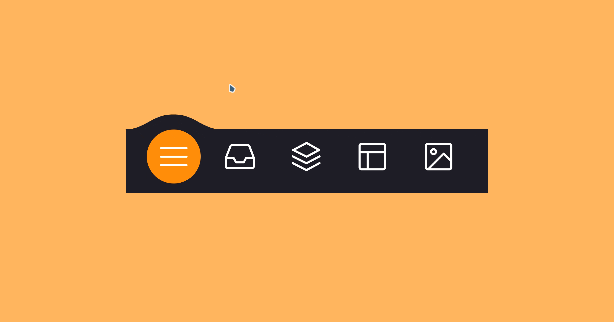

# Fluid Tabs Bar Navigation 🗂️

Este proyecto demuestra cómo crear una barra de navegación fluida con pestañas utilizando HTML, CSS y JavaScript. La barra de navegación cuenta con cinco elementos, cada uno representado por un icono único. Al hacer clic en una pestaña seleccionada, su apariencia cambiara con una transicion suave 😮

## Características

- **Elementos Interactivos** 👆👇: Los usuarios pueden interactuar con los elementos de la navegación, cambiando el estado activo.
- **Iconos Personalizados** 🎨: Cada pestaña utiliza iconos SVG personalizados para un diseño visualmente atractivo.
- **Animaciones CSS** 💫: El estado activo de una pestaña incluye una animación CSS que mejora la retroalimentación visual.

